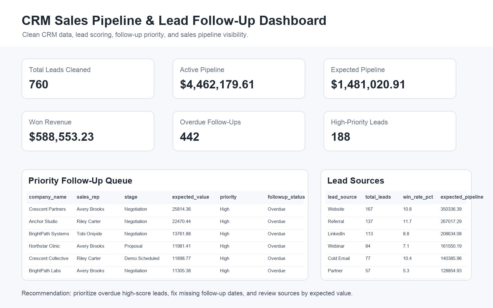

# CRM Sales Pipeline & Lead Follow-Up Automation System

Portfolio project for Business Administration + CIST positioning.

## 30-Second Summary

I built a repeatable CRM reporting workflow that takes messy lead data, cleans it with Python, scores the leads, analyzes the sales pipeline with SQL, and creates a follow-up dashboard for weekly sales operations decisions.

This project shows sales operations, lead management, CRM cleanup, follow-up discipline, dashboard reporting, and business process improvement.

## Visual Proof



Open the generated outputs:

- [Portfolio showcase](reports/portfolio_showcase.html)
- [CRM sales pipeline dashboard](reports/crm_sales_pipeline_dashboard.html)
- [Executive summary](reports/executive_summary.md)

## Key Results

- 760 CRM leads cleaned
- $4,462,180 active pipeline value analyzed
- $1,481,021 expected pipeline value calculated
- $588,553 won revenue identified
- 442 overdue follow-ups surfaced
- 188 high-priority active leads identified
- Follow-up queue generated with recommended actions

## Business Scenario

A small business, agency, startup, or service team is tracking leads across CRM exports and spreadsheets. The data is messy and hard to use:

- Duplicate lead records
- Inconsistent lead sources and sales stages
- Missing follow-up dates
- Invalid deal values
- Unclear lead priority
- No view of overdue follow-ups
- No clear pipeline value by sales rep, source, stage, or industry

Without a clean reporting workflow, the team can lose revenue even when demand exists because the next best action is unclear.

## What I Built

The system creates a clean sales operations workflow:

1. Generates a realistic messy CRM lead dataset.
2. Cleans and standardizes CRM fields with Python.
3. Deduplicates lead records.
4. Creates lead scoring fields using stage, source, engagement, meeting count, deal value, and contact recency.
5. Creates follow-up status fields for overdue, due today, due this week, missing, and scheduled leads.
6. Loads the cleaned data into SQLite.
7. Runs SQL analysis for KPI summary, follow-up queue, sales rep performance, source performance, stage conversion, and industry pipeline.
8. Exports dashboard-ready CSV files.
9. Generates a static HTML dashboard, screenshot preview, and executive summary.

## Skills Demonstrated

- Python data cleaning
- SQL analysis
- SQLite reporting workflow
- CRM data cleanup
- Lead scoring
- Sales pipeline analysis
- Dashboard creation
- KPI reporting
- Follow-up automation logic
- Business operations analysis
- CIST systems thinking

## Project Structure

```text
crm_sales_pipeline_automation_system/
  README.md
  case_study.md
  src/
    build_case_study.py
  data/
    raw/
      crm_leads_raw.csv
    processed/
      clean_crm_leads.csv
      sales_pipeline.sqlite
      pipeline_kpi_summary.csv
      followup_queue.csv
      rep_performance.csv
      source_performance.csv
      stage_conversion.csv
      industry_pipeline.csv
  sql/
    analysis_queries.sql
  reports/
    portfolio_showcase.html
    crm_sales_pipeline_dashboard.html
    executive_summary.md
  assets/
    screenshots/
      crm_dashboard_preview.png
  scripts/
    build_dashboard_preview.py
  freelance/
    application_kit.md
  portfolio_assets/
    linkedin_project_copy.md
```

## How To Run

From this project folder:

```bash
python3 src/build_case_study.py
```

Optional, regenerate the dashboard preview image:

```bash
python3 scripts/build_dashboard_preview.py
```

Then open:

```text
reports/portfolio_showcase.html
reports/crm_sales_pipeline_dashboard.html
reports/executive_summary.md
assets/screenshots/crm_dashboard_preview.png
```

## Portfolio Pitch

This project shows how I combine business administration and CIST thinking. I can take messy CRM or spreadsheet data, clean it into a usable reporting system, create lead scoring and follow-up logic, and communicate the next actions in a dashboard that supports business decisions.

## Freelance Services This Supports

- CRM export cleanup
- Sales pipeline dashboards
- Lead follow-up tracking
- Excel/CSV cleanup
- SQL reporting
- Lead scoring systems
- Weekly sales operations reports
- Business process documentation
- AI-assisted sales workflow documentation

## Next Improvements

- Add a Power BI version of the dashboard.
- Add a short video walkthrough.
- Add a Google Sheets version for lightweight client delivery.
